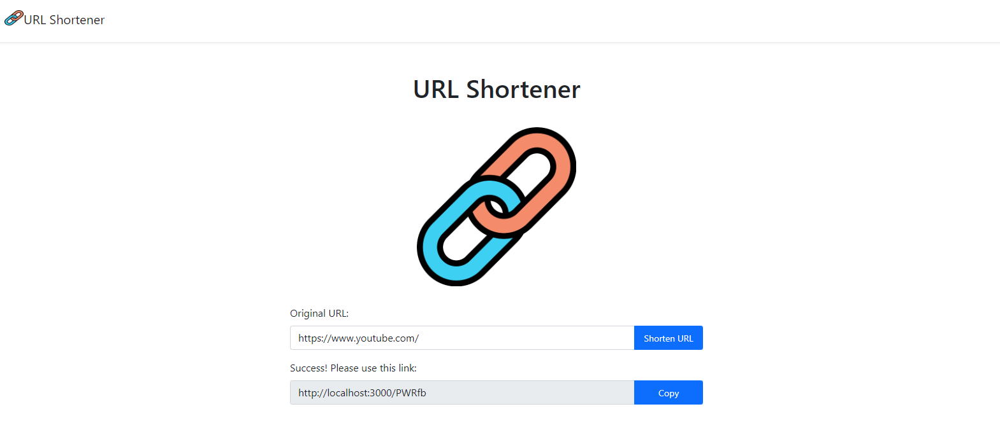

# shorten-url

## Website Display - 網站展示



## About - 介紹

將長長的網址縮成短短的「短網址產生器」

## Features - 功能

1. 使用者可以輸入網址
2. 使用者點擊 Shorten URl 後可轉換成短網址
3. 使用者可以點擊 copy 複製短網址，並跳出複製成功訊息
4. 使用者輸入短網址可跳轉回原網址
5. 使用者輸入同樣的網址，產生的短網址是一樣的
6. 若沒有輸入URL，會彈出警告!

## Installation and execution - 安裝與執行步驟

1.請先確認有安裝 [Node.js](https://nodejs.org/en/download/)

2.開啟Terminal, Clone此專案至本機:

```
git clone https://github.com/DannyHucc/shorten-url.git
```

3.進入存放此專案的資料夾

```
cd shorten-url
```

4.安裝 npm 套件

```
npm install
```

5.安裝 nodemon (如果已有可跳過)

```
npm install -g nodemon
```

6.使用專案內的 .env.exp 檔案 或者 MongoDB cloud 獲得你的 connection string

```
mongodb+srv://mongodb://<username>:<password>@ac-3f4gsxu-shard-00-00.ngwexuq.mongodb.net:27017,ac-3f4gsxu-shard-00-01.ngwexuq.mongodb.net:27017,ac-3f4gsxu-shard-00-02.ngwexuq.mongodb.net:27017/?ssl=true&replicaSet=atlas-t2p2bu-shard-0&authSource=admin&retryWrites=true&w=majority
```

7.在專案內創造一個 .env 檔案，並在其輸入你的 MongoDB connection string，並更改你 MongoDB 的 `username`、`password`、`database name`

* \<username>
* \<password>
* \<database name>

```
MONGODB_URL=mongodb+srv://mongodb://<username>:<password>@ac-3f4gsxu-shard-00-00.ngwexuq.mongodb.net:27017,ac-3f4gsxu-shard-00-01.ngwexuq.mongodb.net:27017,ac-3f4gsxu-shard-00-02.ngwexuq.mongodb.net:27017/<database name>?ssl=true&replicaSet=atlas-t2p2bu-shard-0&authSource=admin&retryWrites=true&w=majority
```

8.啟動伺服器 (這會使用 nodemon 啟動專案)

```
npm run dev 
```

9.當 terminal 出現以下字樣，表示伺服器已啟動並成功連結

```
Express is listening on localhost:3000
mongodb connected!
```

10.打開瀏覽器輸入以下網址來使用本專案

```
http://localhost:3000 
```

11.若欲暫停使用

```
ctrl + c
```

## Development Tools - 開發工具

* Node.js
* Nodemon
* Body-parser: "1.20.2"
* Express: "4.18.2"
* Express-handlebars: "4.0.2"
* Dotenv: "16.0.3"
* Bootstrap: "5.1.3"
* MongoDB
* Mongoose: "7.0.3"